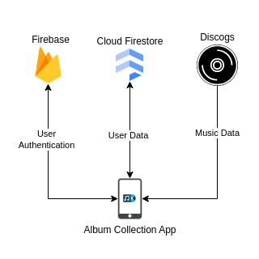
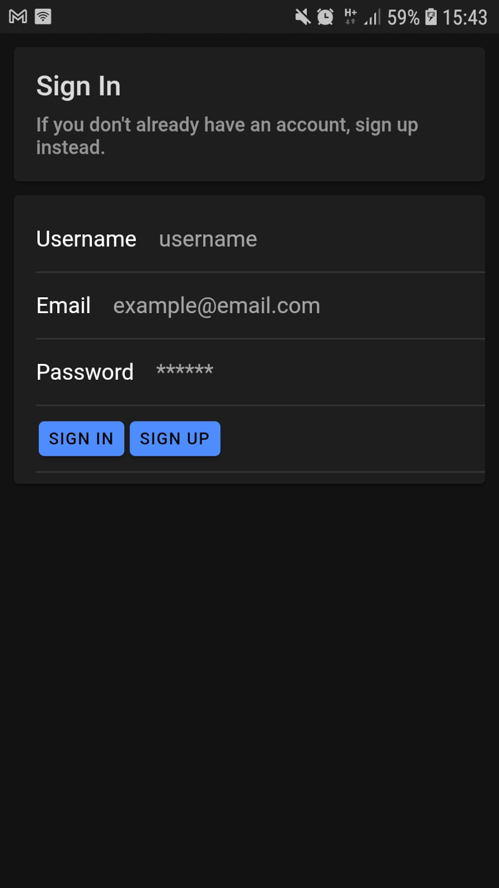
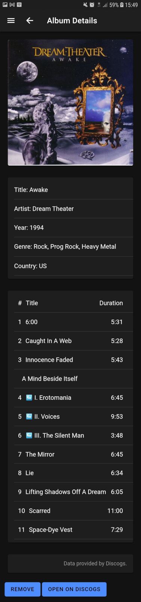
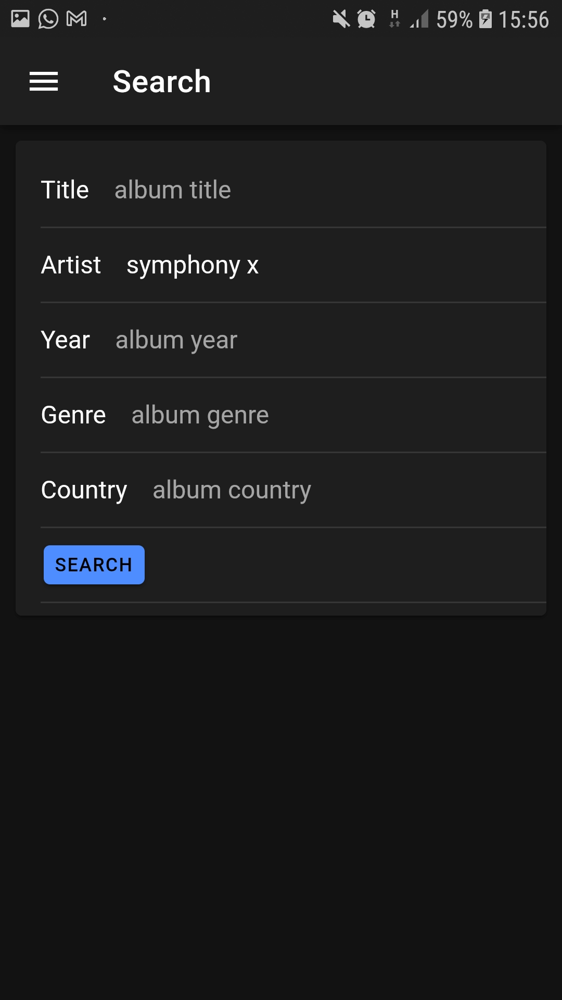
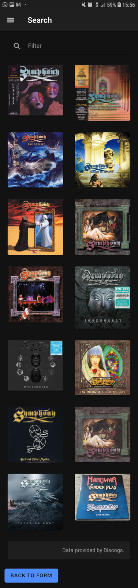
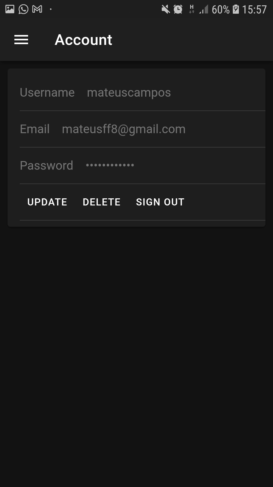
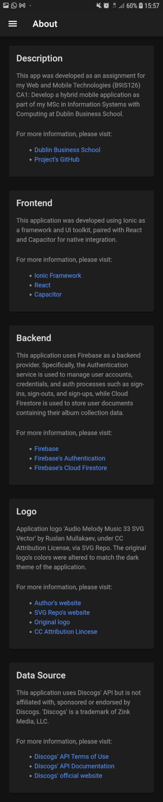
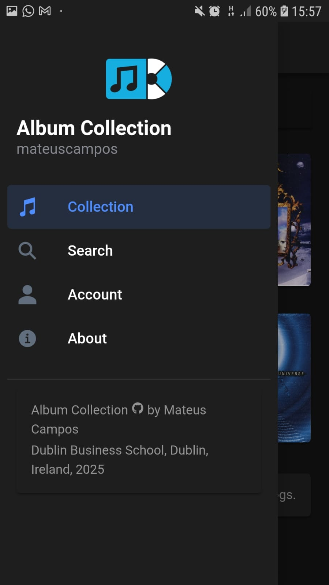

# Album Collection Hybrid Mobile Application

**Dublin Business School**  
**MSc in Information Systems with Computing**  
**Web and Mobile Technologies - B9IS126**  
**Year 1, Semester 1**  
**Continuous Assessment 1**

**Lecturer name:** Ehtisham Yasin

**Student Name:** Mateus Fonseca Campos  
**Student Number:** 20095949  
**Student Email:** 20095949@mydbs.ie

**Submission date:** 29 December 2025

This repository contains an "Album Collection Hybrid Mobile Application" developed for my Web and Mobile Technologies CA 1 at Dublin Business School - MSc in Information Systems with Computing, Year 1, Semester 1.

**[Download the Android prototype](https://github.com/20095949-mateus-campos/album-collection/releases/download/v0.1.0-prototype/album-collection-v0.1.0-prototype.apk)**

## Part 1: Background

The goal of this assignment was to develop a hybrid mobile application for a business of my choice. The application should be built using several familiar web technologies such as HTML5, CSS and Javascript and then seamlessly deployed to platforms such as iOS, Android, and Windows Phone (at least one). It should be touch friendly and provide actual functionality which users can take advantage of. Use of UI frameworks such as jQuery Mobile, Sencha Touch, Kendo UI, or any other platforms discussed in the module, was allowed.

The below is the list of the assignment's tasks:

- [x] A completed hybrid mobile application, using the technologies discussed in the lectures. This must have all the necessary configurations and folder structures.

- [x] Include at least TWO appropriate plugins in your mobile app available from the plugin repositories discussed in the class.

- [x] Add a Splash Screen to your app suitable for your chosen platform.

- [x] Add icons to your app suitable for your chosen platform.

- [x] Using the frameworks discussed in the class, prepare a build for the mobile application platform that you’ve chosen. Deploy and test the resulting build file on an actual device or an emulator.

- [x] The application should be user friendly, consistent, error free and touch friendly when installed on a mobile platform or viewed on an emulator.

## Part 2: System Requirements and Design

The choice of application was an app the allows users to keep track of music albums they have listened to by adding them to a personal collection.

Music data is retrieved from Discogs via their public API. User data and authentication is managed via Firebase.

Based on the requirements gathered and the assignment's instructions, the following implementation plan was devised:

1. Backend:
    - Role: server-side services used to manage the application's data via API calls.
    - Music database: Discogs.
    - User database: Firebase Cloud Firestore.
    - User authentication: Firebase Authentication.
2. Frontend:
    - Role: a client-side, reactive application whose components are redenred natively to the running platform.
    - Language: TypeScript.
    - Library: React.
    - Framework: Ionic.
    - Native runtime: Capacitor.
    - Build tool: Vite.

The following flowchart presents a basic overview of the application's core operations:

|  |
| :-: |
| *App's basic operations* |

## Part 3: Setup

In order to run this project locally, there are a few environment configuration steps that need to be taken.

Install Node.js on Linux (refer to Node.js' [official guide](https://nodejs.org/en/download/) for alternatives):

```
# Download and install nvm:
curl -o- https://raw.githubusercontent.com/nvm-sh/nvm/v0.40.3/install.sh | bash && \

# in lieu of restarting the shell
\. "$HOME/.nvm/nvm.sh" && \

# Download and install Node.js:
nvm install 24 && \

# Verify the Node.js version:
node -v && \ # Should print "v24.12.0".

# Verify npm version:
npm -v # Should print "11.6.2".
```

Install the Ionic CLI ([official guide](https://ionicframework.com/docs/intro/cli)):

```
npm install -g @ionic/cli
```

You may then clone this repository to your preferred location, install all project dependencies and run the application:

```
git clone https://github.com/20095949-mateus-campos/album-collection.git && \
cd album-collection && \
npm install && \
ionic serve
```

The above will run the web version of the application only, for the mobile version you must install [Android Studio](https://developer.android.com/studio) and then run:

```
npm install @capacitor/android && \ # install Android package for Capacitor
npx cap add android && \ # android to the project
npx cap open android && \ # open it on Android Studio
npx cap run android # run the app; the target device (USB-connected or an emulator) can be selected on Android Studio
```

## Part 4: Proof of Concept

Following the plan established in the previous section, a prototype was developed. Being only a proof of concept, the application has, as of now, limited functionalities. Extra features would have included: artist tracking, song tracking, multiple data sources (AllMusic, Last.fm, MusicBrainz, Rate Your Music, etc.), in-app user communication (messaging, sharing, tagging, etc.), integration with music streaming services (Spotify, Apple Music, Amazon Music, Tidal, Deezer, YouTube Music, etc.), user-level manual addition/editing (for content that may be unavailable/incorrect from data sources), among others.

The below is a list of the native Capacitor plugins used by the app:

- **@capacitor/browser:** opens the device's default browser inside the app.
- **@capacitor/splash-screen:** creates a splash screen for when the app is open.
- **@capacitor/status-bar:** allows for in-code styling of the device's status bar.
- **@capacitor/toast:** displays a dismissible toast notification.

The below is a breakdown of the project’s file structure (auto-generated files have been omitted):

```
.
├── assets
│   ├── icon-background.png
│   ├── icon-foreground.png
│   ├── icon-only.png
│   ├── splash-dark.png
│   └── splash.png
├── global.css
├── index.html
├── public
│   ├── favicon.png
│   ├── manifest.json
│   └── menu_logo.png
├── README.md
├── screenshots
│   ├── about.jpeg
│   ├── account-details.jpeg
│   ├── album-details.jpeg
│   ├── authentication.jpeg
│   ├── collection.jpeg
│   ├── flowchart.png
│   ├── menu.jpeg
│   ├── search-form.jpeg
│   └── search-results.jpeg
└── src
    ├── App.tsx
    ├── components
    │   ├── About.css
    │   ├── About.tsx
    │   ├── AlbumDetails.css
    │   ├── AlbumDetails.tsx
    │   ├── AlbumList.css
    │   ├── AlbumList.tsx
    │   ├── Menu.css
    │   ├── Menu.tsx
    │   ├── SearchForm.css
    │   ├── SearchForm.tsx
    │   ├── SignIn.css
    │   ├── SignIn.tsx
    │   ├── UserDetails.css
    │   └── UserDetails.tsx
    ├── main.tsx
    ├── models
    │   ├── Album.ts
    │   ├── Track.ts
    │   └── User.ts
    ├── pages
    │   ├── Page.css
    │   └── Page.tsx
    └── services
        ├── discogs.ts
        └── firebase.ts
```
The following are some screenshots of the application in use, showcasing core operations and native functionalities:

|  |  |
| :-: | :-: |
| *Authentication* | *Collection* |

|  |  |
| :-: | :-: |
| *Album details* | *Search form* |

|  |  |
| :-: | :-: |
| *Search results* | *Account details* |

|  |  |
| :-: | :-: |
| *About* | *Menu* |

## Part 5: References

Below is a list of the documentation referenced during this assignment:

- **[Ionic Docs](https://ionicframework.com/docs/)**
- **[Capacitor Docs](https://capacitorjs.com/docs/)**
- **[React Docs](https://react.dev/)**
- **[MDN Docs](https://developer.mozilla.org/en-US/)**
- **[Firebase Docs](https://firebase.google.com/docs)**
- **[Discogs API Docs](https://www.discogs.com/developers?srsltid=AfmBOoqUVtHJ2uViKT03lDshVKV-QBpwyOlm1cwf_lqttUpjfYo1YhSP)**
- **[SVG Repo](https://www.svgrepo.com/)**

## Part 6: Copyright Disclaimer

This application uses Discogs' API but is not affiliated with, sponsored or endorsed by Discogs. 'Discogs' is a trademark of Zink Media, LLC ([Terms of Use](https://support.discogs.com/hc/en-us/articles/360009334593-API-Terms-of-Use)).

Application logo ['Audio Melody Music 33 SVG Vector'](https://www.svgrepo.com/svg/419725/audio-melody-music-33) by [Ruslan Mullakaev](https://dribbble.com/ruslan_design?ref=svgrepo.com), under [CC Attribution License](https://creativecommons.org/share-your-work/cclicenses/), via [SVG Repo](https://www.svgrepo.com/). The original logo's colors were altered to match the dark theme of the application.

This project may feature content that is copyright protected. Please, keep in mind that this is a student's project and has no commercial purpose whatsoever. Having said that, if you are the owner of any content featured here and would like for it to be removed, please, contact me and I will do so promptly.

Thank you very much,  
Mateus Campos.